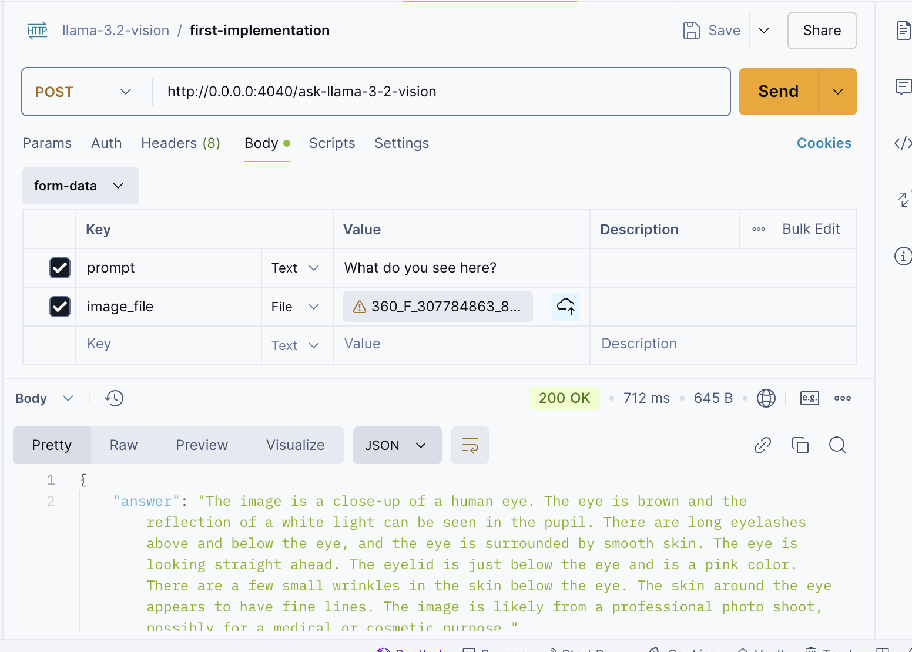

# LLAMA 3.2 Vision Implementation 🦙👁️

Script to load and use LLAMA model for image analysis

## 🗂️ Pre-requirements
1. Groq account
2. Groq API key 

>[!NOTE]
> Obtain your API key [here](https://console.groq.com/docs/quickstart)

## 🏛️ Structure
- `imgs` -> Folder that contain the images to analyze🕶️
- `api.py` -> Script that uses the LLAMA 3.2 Vision as an endpoint
- `llama_vision.ipynb` -> Notebook implementation of the model
 

## 🤖 Steps 2 Follow
1. Install all the requirements
```sh
pip install -r requirements.txt
```

2. Create a .env file with his value:
```
GROQ_API_KEY=
```

3. Follow the Jupyter Notebook and run each cell

4. If you want to test the `api.py`.
```sh
python api.py
```

Try it out in Postman with the following configuration




## 🐋 Dockerfile
Run these commands to generate and activate the container:

```sh
docker build -t llama-vision:latest .
docker run -p 4040:4040 --env-file .env llamavision:latest
```

> [!NOTE]
> You can download the Notebook and run it in a Colab environment. 