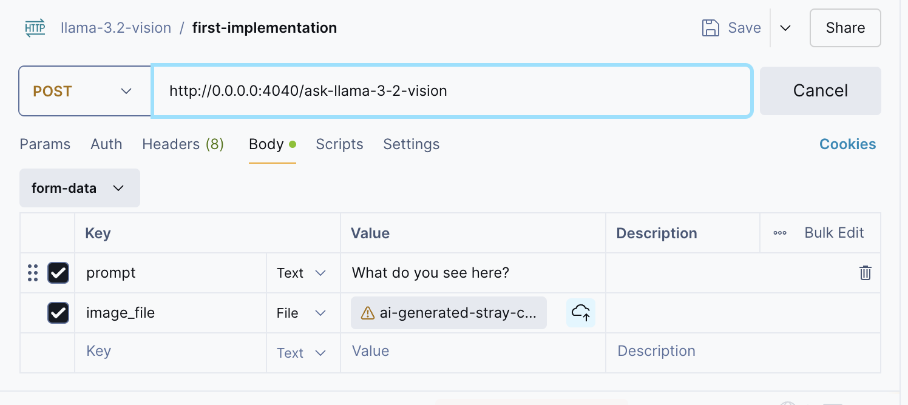

# LLAMA 3.2 Vision Implementation 🦙👁️

Script to load and use LLAMA model for image analysis

>[!IMPORTANT]
> The time execution will depend on your machine components. (RAM, GPU, etc)

## 🗂️ Pre-requirements
1. Hugging Face account
2. Permission to the model. Request it [here](https://huggingface.co/meta-llama/Llama-3.2-11B-Vision)
3. Hugging Face token

## 🏛️ Structure
- `imgs` -> Folder that contain the images to analyze🕶️
- `api.py` -> Script that uses the LLAMA 3.2 Vision as an endpoint
- `llama_vision.ipynb` -> Notebook implementation of the model
 

## 🤖 Steps 2 Follow
1. Install all the requirements
```sh
pip install -r requirements.txt
```

2. Follow the Jupyter Notebook and run each cell

3. If you want to test the `api.py`. First, log in to Hugging Face through terminal using your token:

```sh
git config --global credential.helper store
huggingface-cli login
```

Then, run:
```sh
pip install --upgrade scipy transformers
```

... and finally start the API.
```sh
python api.py
```

Try it out in Postman with the following configuration




## 🐋 Dockerfile

> [!WARNING]
> You may need to do a previous step

Create a `.env` file with this value: 

    HUGGING_FACE_HUB_TOKEN=

... and paste your own Hugging Face token.

After that, run these commands to generate and activate the container:

```sh
docker build -t llama-vision:latest .
docker run -p 4040:4040 --env-file .env llamavision:latest
```


> [!NOTE]
> You can download the Notebook and run it in a Colab environment. 